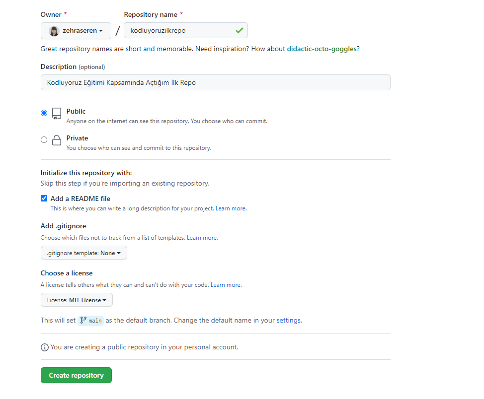

# Kodluyoruz İlk Repo
------------------------------------------------------------------------------------------------

Bu repo, [Kodluyoruz](www.kodluyoruz.org) Front-End Eğitimi kapsamında açtığım ilk repodur. İçerisinde bir adet README.md dosyası, bir adet index.html barındırıyor.



# Installation

Önce projeyi klonladık (buraya kendi repomuzdan aldığımız link gelecek).

``` 
git clone https://github.com/zehraseren/kodluyoruzilkrepo.git
```

------------------------------------------------------------------------------------------------

# Usage 

Projeyi klonladıktan sonra Visual Studio Code programında açtık.

```
Linux için:
cd kodluyoruzilkrepo
code.
```

------------------------------------------------------------------------------------------------

# Contributing

Pull requestler kabul edilir. Büyük değişiklikler için, lütfen önce neyi değiştirmek istediğinizi tartışmak için bir konu açınız.

------------------------------------------------------------------------------------------------

# License
[MIT](https://choosealicense.com/licenses/mit/)

------------------------------------------------------------------------------------------------

[Patika.dev](https://www.patika.dev/tr)
